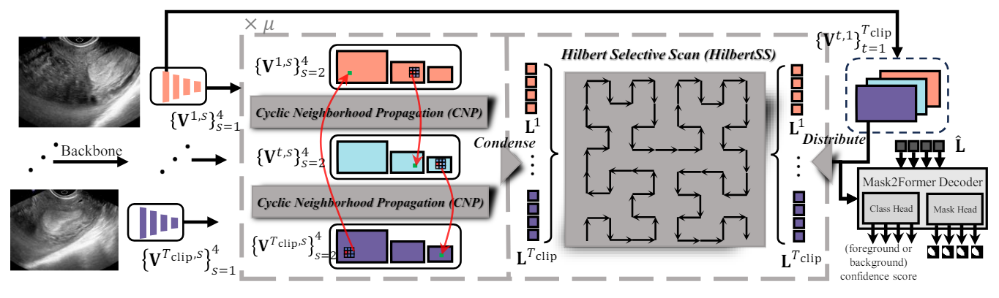
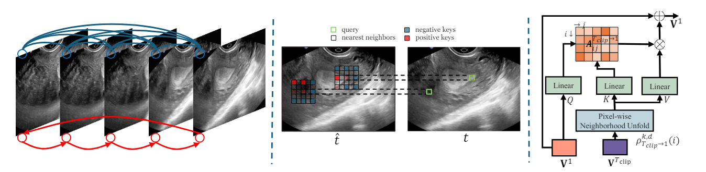
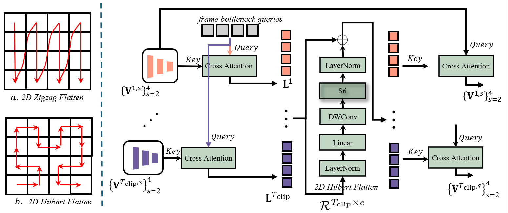

## LGRNet: Local-Global Reciprocal Network for Uterine Fibroid Segmentation in Ultrasound Videos 
Huihui Xu, Yijun Yang(Collect UFUV data), Angelica Aviles-Rivero, Guang Yang, Jing Qin, and Lei Zhu*


[`Paper`](https://arxiv.org/abs/2407.05703) | [`BibTeX`](#citing) 

[](https://paperswithcode.com/sota/video-polyp-segmentation-on-sun-seg-easy-1?p=lgrnet-local-global-reciprocal-network-for)
	
[](https://paperswithcode.com/sota/video-polyp-segmentation-on-sun-seg-hard-1?p=lgrnet-local-global-reciprocal-network-for)


This is the official implmentation of LGRNet (MICCAI'24 Early Accept), which incorporates local Cyclic Neighborhoold Propagation and global Hilbert Selective Scan to both efficiently and effectively aggregate the local-global temporal context. 

<div align="justify">As an example for ultrasound video, a single frame is too noisy and insufficient for accurate lesion diagnosis. In practice, doctors need to check the whole video to predict possible lesion region and filter out irrelevent surrounding issues </div>
</br>
<div align="center" style="padding: 0 100pt">

</div>
</br>
<div align="justify">TURTLE is a method that enables fully unsupervised transfer from foundation models. The key idea behind our approach is to search for the labeling of a downstream dataset that maximizes the margins of linear classifiers in the space of single or multiple foundation models to uncover the underlying human labeling. Compared to zero-shot and supervised transfer, unsupervised transfer with TURTLE does not need the supervision in any form. Compared to deep clustering methods, TURTLE does not require task-specific representation learning that is expensive for modern foundation models.</div>


## Getting started

1. Installation: Please refer to [INSTALL.md](assets/INSTALL.md) for more details.
2. Data preparation: Please refer to [DATA.md](assets/DATA.md) for more details.
3. Training: Please refer to [TRAIN.md](assets/TRAIN.md) for more details.
4. Testing: Please refer to [TEST.md](assets/TEST.md) for more details. 
5. Model zoo: Please refer to [MODEL_ZOO.md](assets/MODEL_ZOO.md) for more details.

# Introduction 

LGRNet consists of a backbone, a spatial-temporal encoder, and a Mask2Former decoder, as illustrated in Figure. Each encoder layer is composed of a CNP layer and HilbertSS layer, which aggregates temporal context in a local-global manner.


The CNP layer is a temporal extensioin of Neighborhood Attention. We also add local cyclic inter-frame dependency constraint for more efficient propagation.


The HilberSS layer takes the highly-semantic frame bottleneck queries as input, selectively scans the queries in Hilbert manner to enable global temporal context propagation. The global context is then cross-attended to each frame feature maps for local refinement, which forms a reciprocal net.



Based on the above designs, LGRNet can be used as a baseline for binary or multi-semantic Medical Video Object Segmentation.


# Results

## UFUV


## CVCs


## SUN-SEG


# Citing LGRNet

<!-- ```
@misc{wu2023GLEE,
  author= {Junfeng Wu, Yi Jiang, Qihao Liu, Zehuan Yuan, Xiang Bai, Song Bai},
  title = {General Object Foundation Model for Images and Videos at Scale},
  year={2023},
  eprint={2312.09158},
  archivePrefix={arXiv}
}
``` -->

## Acknowledgments

- Thanks [Gilbert](https://github.com/jakubcerveny/gilbert) for the implementation of Hilbert curve generation.
<!-- 
- Thanks [Natten](https://github.com/SHI-Labs/NATTEN) for Neighborhood Attention.

- Thanks [Mamba](https://github.com/state-spaces/mamba) for S6.

- Thanks [VMamba](https://github.com/MzeroMiko/VMamba) for SS2D.

- Thanks [Mask2Former](https://github.com/jakubcerveny/gilbert) for the implementation of Hilbert curve generation. --># LGRNet
